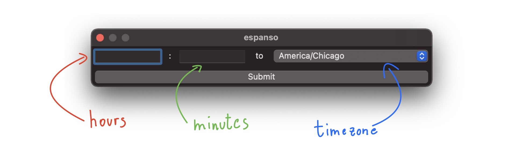

# Time Zone Converter

Convert local time to a target timezone.
This package relies on [macOS date command](https://ss64.com/osx/date.html).

## Usage

The trigger `:time` will open a dialog:



Insert a 24-hour formatted (e.g. `16:45`) local time and select a target timezone.
Then click submit or `ctrl + Enter` (macOS) and the trigger will be replaced by the converted time.

## Customization

`American/Chicago` is the default value when selecting the target timezone.
To change it, edit the installed package file at `$PACKAGES_PATH/time-zone-converter/package.yml` where `$PACKAGES_PATH` is the "Packages" path returned by `espanso path`.

E.g. to edit with vim

```
vim $(espanso path | grep Packages | cut -d' ' -f2)/time-zone-converter/package.yml
```

or if you have espanso v2

```
espanso edit match/packages/shruggie/package.yml
```

At nearly line `17` (`default: America/Chicago`) replace `America/Chicago` with your default timezone of choice. A list of timezones is avaible in the below lines.
Alternatively, you can run `sudo systemsetup -listtimezones`.
